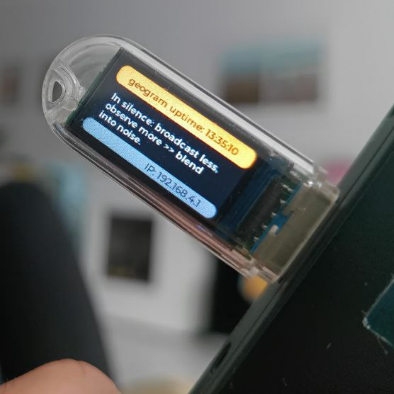

# Geogram T-Dongle S3 Firmware

Custom firmware for the [LilyGO T-Dongle S3](https://www.lilygo.cc/products/t-dongle-s3), enabling it to function as a **portable off-grid communication device** for the **Geogram mesh network**. The device broadcasts presence, receives messages from nearby devices, and displays live chat on its built-in OLED screen—all without internet connectivity.



---

## 📡 Features

- 📶 **BLE Mesh Communication**
  Broadcasts presence packets every 10 seconds with unique device identification (LT1-0.0.1).

- 💬 **Live Chat Display**
  Receives and displays messages from nearby Geogram devices on the OLED screen in real-time.

- 🔁 **Geogram Android Integration**
  Works seamlessly with the Geogram Android app for mesh networking and message relay.

- 🏷️ **Device Identification**
  Uses compact device codes (LT1 = LilyGo T-Dongle) with version tracking.

- 🤝 **BLE Collision Avoidance**
  Random transmission delays prevent interference with other nearby devices.

- 💡 **OLED Status Display**
  Shows callsign, received messages, battery voltage, and connection status on the 0.91" OLED.

- 🔋 **Battery Voltage Monitoring**
  Real-time battery voltage display from internal ADC.

- 📝 **Persistent Callsign**
  Auto-generates unique callsign (X1XXXX format) stored in non-volatile memory.

- 🔧 **USB Serial Debugging**
  Console logs at 115200 baud for diagnostics and development.

---

## 📱 Get the Android App

The T-Dongle works with the Geogram Android app for mesh networking:

- **Latest APK**: [Download from GitHub Releases](https://github.com/geograms/geogram-android/releases)
- **Source Code**: [geogram-android](https://github.com/geograms/geogram-android)

Install the Android app to:
- Send and receive messages through the mesh network
- View nearby devices and their signal strength
- Act as a relay for extending network range
- Access additional features like GPS-based location sharing

---

## 🧱 Hardware Requirements

- **LilyGO T-Dongle S3**
  - ESP32-S3 microcontroller
  - BLE + WiFi
  - 0.91" I²C OLED display
  - JST battery connector with charging
  - USB-C for power and programming

**Where to Buy:**
- [LilyGO Official Store](https://www.lilygo.cc/products/t-dongle-s3)
- [AliExpress](https://www.aliexpress.com/w/wholesale-lilygo-t-dongle-s3.html)

---

## ⚡ Quick Start

### Option 1: Web-Based Flashing (Easiest - Chrome/Edge Only)

Flash the firmware directly from your browser—no software installation required!

1. **Download the latest firmware**: [geogram-tdongle-v0.0.1.bin](https://github.com/geograms/geogram-tdongle/releases/download/v0.0.1/geogram-tdongle-v0.0.1.bin)

2. **Open the Web Flasher**:
   - Visit: [ESP Web Tools Flasher](https://adafruit.github.io/Adafruit_WebSerial_ESPTool/)
   - Or use: [ESP Tool (Alternative)](https://espressif.github.io/esptool-js/)

3. **Connect your T-Dongle**:
   - Plug in via USB-C
   - Click "Connect" in the web flasher
   - Select your device's COM/serial port

4. **Flash the firmware**:
   - Choose the downloaded `.bin` file
   - Set flash address to: `0x10000`
   - Click "Program"
   - Wait for completion (~30 seconds)

5. **Done!** Your T-Dongle will restart automatically.

> **Note**: Web Serial API is only supported in Chrome, Edge, and Opera browsers. Safari and Firefox are not supported.

---

### Option 2: Command Line (All Platforms)

Using [esptool.py](https://github.com/espressif/esptool) (requires Python):

```bash
# Install esptool if not already installed
pip install esptool

# Download the latest firmware
wget https://github.com/geograms/geogram-tdongle/releases/download/v0.0.1/geogram-tdongle-v0.0.1.bin

# Flash to your device (change /dev/ttyACM0 to your port)
esptool.py --chip esp32s3 --port /dev/ttyACM0 --baud 921600 \
  write_flash 0x10000 geogram-tdongle-v0.0.1.bin
```

**Find your port:**
- **Linux/Mac**: `/dev/ttyUSB0` or `/dev/ttyACM0`
- **Windows**: `COM3`, `COM4`, etc. (check Device Manager)

---

### Option 3: Build from Source

For developers who want to customize the firmware:

```bash
# Clone the repository
git clone https://github.com/geograms/geogram-tdongle.git
cd geogram-tdongle

# Build and flash with PlatformIO
pio run --target upload

# Monitor serial output
pio device monitor -b 115200
```

**Requirements:**
- [PlatformIO](https://platformio.org/) installed
- USB-C cable
- ESP32-S3 drivers (usually auto-installed)

---

## 🔍 Troubleshooting

### Device not detected
- Try a different USB-C cable (some are power-only)
- Install [CP210x drivers](https://www.silabs.com/developers/usb-to-uart-bridge-vcp-drivers) for Windows
- On Linux, add user to `dialout` group: `sudo usermod -a -G dialout $USER`

### Flash failed
- Hold the BOOT button while plugging in USB
- Reduce baud rate to 115200: `--baud 115200`
- Try different USB port (use USB 2.0 ports)

### No output on OLED
- Wait 10 seconds for first ping broadcast
- Check serial monitor for error messages
- Verify battery connection if using battery power

---

## 📦 Releases

All firmware releases are available on GitHub:

**Latest**: [v0.0.1](https://github.com/geograms/geogram-tdongle/releases/tag/v0.0.1)

### Changelog

**v0.0.1** (2025-11-10)
- Initial release with device code system
- 10-second ping broadcasts
- BLE collision avoidance
- Live chat display on OLED
- Compact device identification (LT1-0.0.1)
- Persistent callsign generation

---

## 🔤 Device Codes

Geogram uses compact 3-letter codes for device identification:

| Code | Device | Description |
|------|--------|-------------|
| **LT1** | LilyGo T-Dongle | This device |
| **APP** | Android Phone | Geogram Android app |
| **LT2** | LilyGo T-Deck | Future support |
| **RPI** | Raspberry Pi | Future support |
| **K5R** | Quansheng K5 | Future support |

Format: `CODE-VERSION` (e.g., `LT1-0.0.1`)

---

## 🌐 How It Works

The T-Dongle creates an **off-grid mesh network** using Bluetooth Low Energy:

1. **Broadcasting**: Every 10 seconds, it broadcasts a presence packet containing:
   - Unique callsign (e.g., X1ABCD)
   - Device code and version (LT1-0.0.1)
   - GPS coordinates (if available from paired device)

2. **Receiving**: Listens for broadcasts from nearby devices:
   - Android phones running Geogram
   - Other T-Dongles
   - Future: Other compatible devices

3. **Displaying**: Shows received messages on the OLED screen in real-time

4. **No Internet Required**: All communication happens directly between devices over BLE (range: ~10-100 meters depending on environment)

---

## 🔋 Battery Life

Approximate battery life with 300mAh battery:
- **Active mode** (10s pings): ~12-16 hours
- **Low power mode** (60s pings): ~24-36 hours

Tips for extending battery life:
- Reduce OLED brightness
- Increase ping interval
- Use deep sleep between transmissions (future feature)

---

## 🛠️ Development

### Project Structure

```
geogram-tdongle/
├── src/
│   ├── main.cpp           # Main application logic
│   ├── ble/              # BLE communication
│   ├── display/          # OLED display driver
│   └── wifi/             # WiFi utilities
├── releases/             # Binary releases
└── platformio.ini        # Build configuration
```

### Contributing

Contributions are welcome! Please:
1. Fork the repository
2. Create a feature branch
3. Make your changes
4. Submit a pull request

See our [contribution guidelines](https://github.com/geograms/geogram-tdongle/blob/main/CONTRIBUTING.md) for more details.

---

## 📄 License

Licensed under the [Apache License 2.0](https://www.apache.org/licenses/LICENSE-2.0)

---

## 📣 Support

- **Discussions**: [GitHub Discussions](https://github.com/orgs/geograms/discussions)
- **Issues**: [Report bugs](https://github.com/geograms/geogram-tdongle/issues)
- **Documentation**: [Full docs](https://github.com/geograms/geogram-tdongle/tree/main/docs)

---

## 🤝 Contributors

**Primary Contributor**
👤 Max Brito (Portugal/Germany) — 2025–present
- BLE protocol, OLED interface, ESP32 power management, Android integration

See full list: [`CONTRIBUTORS.md`](https://github.com/geograms/geogram-html/blob/main/CONTRIBUTORS.md)

---

## ⭐ Star History

If you find this project useful, please consider giving it a star on GitHub!

[](https://star-history.com/#geograms/geogram-tdongle&Date)
